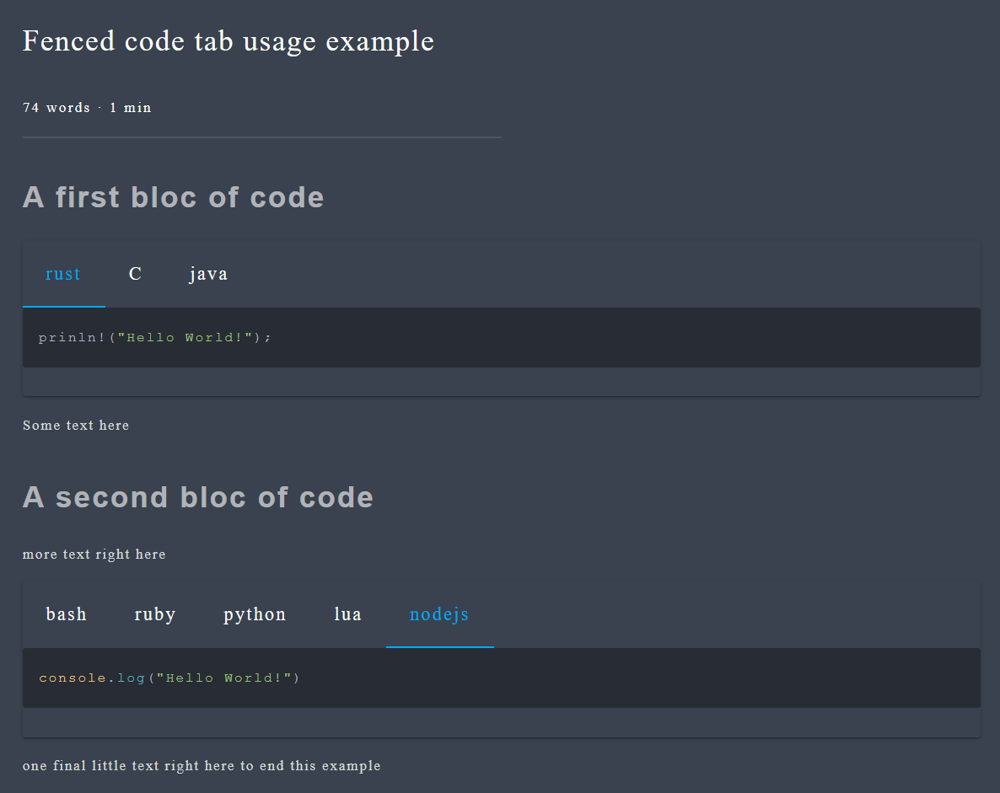

Fenced Code Tabs
================

This is a port of the original [markdown fenced code tabs](https://yassir.dev/markdown-fenced-code-tabs/) project for [zola](https://github.com/getzola/zola).





## How to use it

	
	```rust
	prinln!("Hello World!");
	```
	---
	```C
	prinf("Hello World!\n");
	```
	---
	```java
	system.out.println("Hello World!");
	```
	

This is the code we used to generate the previous picture.

	
	...
	...
	...
	

This is how you call the shortcode, you need to specify the title of each tabs or it'll throw an error.
Each code block needs to be separated by an empty line containing only `---`.
The number of codeblock needs to be equal to the number of tab titles.

## How to include it in you project

You'll need to put the [this](templates/shortcodes/fenced_code_tab.md) file in your `templates/shortcodes` directory.
You can read more about shortcodes [here](https://www.getzola.org/documentation/content/shortcodes/).
You'll also need to include the [css](scss/fenced_code_tab.scss) file in the `scss` directory.
You can read more about css in zola [here](https://www.getzola.org/documentation/content/sass/).

---

Once this is done you'll need to find a way to include the associated css in the pages where the shortcode is used.
There is multiple way to do it:

If you are using your own theme you can add the following line to the `head` part of your `index.html`: `<link rel="stylesheet" href="fenced_code_tab.css">`

---

If you are using another theme and it supports rewriting the header create a file called `templates/index.html` containing these lines:
```


	{{ super() }}
	<link rel="stylesheet" href="fenced_code_tab.css">

```

---

If your theme does not supports this option and you don't want to patch it / fork it.
Copy the file called `themes/[theme_name]/templates/index.html` from your theme to your own `templates/index.html` add this line to the header part of the file: `<link rel="stylesheet" href="fenced_code_tab.css">`
